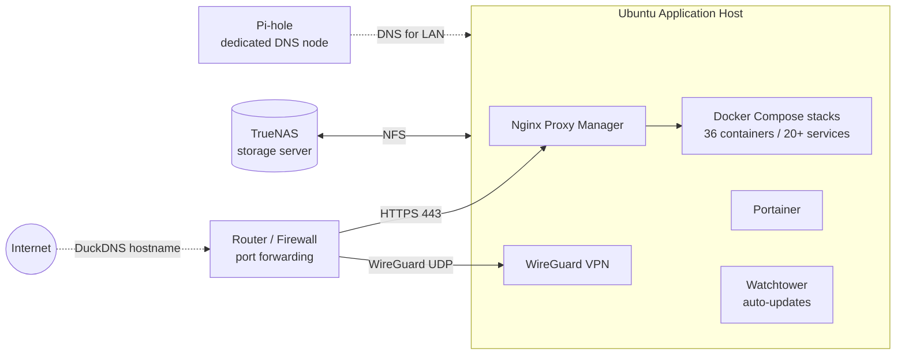

# 🖥️ Home Lab

A self-hosted Linux infrastructure I built and run at home: network storage, **36 Docker containers across 20+ services**, reverse proxy with HTTPS, WireGuard VPN, network-wide DNS filtering, and daily ZFS snapshots.

**Stack:** Ubuntu · TrueNAS · NFS · Docker Compose · Portainer · Nginx Proxy Manager · WireGuard · Pi-hole · cron

---

## Architecture



| Machine | Role | OS |
|---|---|---|
| Application host | Runs all Docker workloads, mounts NAS storage over NFS | Ubuntu |
| Storage server | Bulk storage, snapshots, replication | TrueNAS |
| DNS node | Network-wide DNS filtering with Pi-hole | Ubuntu |

## Hardware

| Machine | Details |
|---|---|
| Storage server | TrueNAS Community Edition 25.10.4 (Goldeye), Intel N100, 7.5 GiB RAM, ZFS pool of 4 drives in RAIDZ1 (7.28 TiB each, 21.2 TiB usable) |
| Application host | ASUS TUF Dash F15 laptop, Intel Core i7-11370H, 14 GiB RAM, 477 GB NVMe SSD, Ubuntu 26.04.1 LTS, Docker 29.8.1 |
| DNS node | Dell Latitude 5490 laptop, Intel Core i7-8650U, 22 GiB RAM, Ubuntu 26.04 LTS, running Pi-hole |

## Services

| Category | Services |
|---|---|
| Files & collaboration | Nextcloud, OnlyOffice |
| Photos | Immich (36,000+ photos and 3,000+ videos) |
| Media | Jellyfin |
| Security | Vaultwarden (password manager) |
| Notes | Joplin |
| Fitness | wger |
| Dashboards & management | Glance, Portainer |
| Automation | Watchtower (container updates) |
| Gaming | Crafty Controller (game server management) |
| AI | Ollama, llama.cpp, Open WebUI, rembg |
| Networking | Nginx Proxy Manager, WireGuard, Pi-hole |

## Networking & Security

- **Reverse proxy:** Nginx Proxy Manager routes each service to its own subdomain with HTTPS certificates
- **Remote access:** WireGuard VPN running on the application host, reached through a DuckDNS dynamic DNS hostname that points to the router
- **Dynamic DNS:** a cron job runs a DuckDNS update script every 5 minutes so the VPN hostname always follows the home IP
- **DNS:** Pi-hole on a dedicated machine for network-wide filtering and local name resolution
- **Firewall:** only required ports are forwarded; everything else stays internal
- **Secrets:** no credentials in this repo. Each stack uses a `.env` file that is git-ignored, with a `.env.example` showing required variables

## Storage & Backups

- **TrueNAS** provides the storage layer, with the application host mounting six shares over **NFSv4.2** (media, Immich photo library, personal files, and a recycle bin)
- **ZFS RAIDZ1** pool (4 drives) tolerates a single drive failure, and regular scrubs check data integrity
- **Daily snapshots** at midnight with 14-week retention protect against accidental deletion and corruption
- **Restore tested:** I've verified recovery by performing a test restore of backed-up data

## Repository Layout

```
homelab/
├── README.md
├── docs/
│   ├── network-diagram.md
│   └── backup-strategy.md
├── stacks/
│   ├── nextcloud/        # docker-compose.yml + .env.example
│   ├── immich/
│   ├── jellyfin/
│   ├── vaultwarden/
│   └── ...
├── scripts/
│   └── backup.sh         # planned: nightly rsync backup of Docker volumes
└── .gitignore
```

## Lessons Learned

- Write down the architecture early. It makes troubleshooting DNS and routing problems much faster.
- Pin image versions for critical services and use Watchtower selectively, since auto-updates can break a working stack.
- A backup you haven't restored from isn't a backup yet.

## Roadmap

- [ ] Document the restore procedure and repeat restore tests on a schedule
- [ ] Automate nightly rsync + cron backups of Docker volumes and configs to the NAS
- [ ] Add an offsite backup (cloud sync or replication to a second TrueNAS) to complete a 3-2-1 strategy
- [ ] Add monitoring and alerting for disk, container, and service health
- [ ] Publish sanitized Compose files for each stack
- [ ] Automate provisioning with Ansible

---

*Built and maintained by [Juan Gamez](https://www.linkedin.com/in/juan-gamez-84b45a23b/).*
